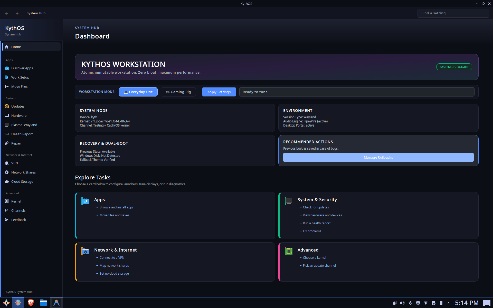

<div align="center">


# KythOS

**An opinionated Fedora Atomic desktop for gaming, work, and recovery.**

KythOS 44 · Based on Fedora Kinoite · KDE Plasma 6 · bootc · Atomic updates · Graphical installer

[Download stable](https://pub-9a3cc72972ea44c4ae7504ee7cda1fa6.r2.dev/kyth-live-latest.iso) · [Download testing](https://pub-9a3cc72972ea44c4ae7504ee7cda1fa6.r2.dev/kyth-live-testing.iso) · [Report a bug](https://github.com/mrtrick37/kyth/issues) · [Discussions](https://github.com/mrtrick37/kyth/discussions)

[](https://github.com/mrtrick37/kyth/actions/workflows/build.yml)
[](https://github.com/mrtrick37/kyth/actions/workflows/build-live-iso.yml)
[](https://github.com/mrtrick37/kyth/actions/workflows/cve-scan.yml)
[](https://securityscorecards.dev/viewer/?uri=github.com/mrtrick37/kyth)
[](https://github.com/mrtrick37/kyth/pkgs/container/kyth)


</div>

## What KythOS is

KythOS is a bootable, installable Linux desktop built from a versioned OCI
image. It combines Fedora Kinoite and KDE Plasma with a graphical installer,
gaming and creator tooling, hardware helpers, a guided first-run experience,
and a System Hub for updates, diagnostics, networking, and repair.

The operating system is updated as a complete deployment with `bootc`. An
update is staged before reboot and the previous deployment remains available
from the boot menu. KythOS can therefore ship useful defaults and newer gaming
technology without giving up a practical recovery path.

KythOS is a personal daily-driver project, not a general-purpose Fedora spin or
a promise that every Windows application and anti-cheat system works on Linux.
Its priorities are:

1. **Reliability** — updates, repair tools, diagnostics, and rollback must leave
   the user a way back.
2. **Stability** — the desktop should remain predictable outside performance
   workloads.
3. **Performance** — gaming and creator workloads get targeted tuning rather
   than permanent system-wide aggression.
4. **Clarity** — strong defaults should be visible, explainable, and reversible.

## Download and install

| Channel | Image tag | Intended use | ISO |
| --- | --- | --- | --- |
| Stable | `latest` | Current daily-driver release | [kyth-live-latest.iso](https://pub-9a3cc72972ea44c4ae7504ee7cda1fa6.r2.dev/kyth-live-latest.iso) |
| Testing | `testing` | New work before stable promotion | [kyth-live-testing.iso](https://pub-9a3cc72972ea44c4ae7504ee7cda1fa6.r2.dev/kyth-live-testing.iso) |

Moving channel releases and immutable archived builds are published on GitHub:
[stable releases](https://github.com/mrtrick37/kyth/releases/tag/iso-latest) and
[testing releases](https://github.com/mrtrick37/kyth/releases/tag/iso-testing).

Practical requirements are an x86-64 PC, a USB drive, an internet connection
during installation, and at least 8 GB of RAM for the live environment. Back up
important data before changing disk partitions.

1. Download the ISO for the channel you want.
2. Write it to a USB drive with Fedora Media Writer, Balena Etcher, Ventoy, or
   another raw-image tool.
3. Boot the USB drive and open **Install KythOS**.
4. Choose the target disk and installation layout, then create the local user.
5. Let the installer pull and deploy the pinned KythOS image.
6. Reboot, open **KythOS System Hub**, and complete the first-run checklist.

The installer uses `bootc install to-disk` under a local graphical frontend.
The ISO build pins the source image digest so the installed deployment matches
the image validated for that release.

### Verify an ISO

Each release includes a SHA-256 checksum, a keyless Cosign bundle, metadata, and
GitHub build provenance. Download the files for the same ISO release, then run:

```bash
sha256sum -c kyth-live-CHANNEL.iso-CHECKSUM

cosign verify-blob \
  --bundle kyth-live-CHANNEL.iso.bundle \
  --certificate-identity-regexp '^https://github\.com/mrtrick37/kyth/\.github/workflows/build-live-iso\.yml@refs/heads/(main|testing)$' \
  --certificate-oidc-issuer https://token.actions.githubusercontent.com \
  kyth-live-CHANNEL.iso

gh attestation verify kyth-live-CHANNEL.iso \
  --repo mrtrick37/kyth \
  --signer-workflow mrtrick37/kyth/.github/workflows/build-live-iso.yml
```

Replace `CHANNEL` with the basename from the release, such as `latest` or
`testing`.

## Day-to-day system management

Most administration is available in System Hub. The equivalent terminal paths
are useful for recovery and automation:

```bash
ujust status                    # booted, staged, and rollback deployments
ujust kyth-upgrade              # stage OS updates and update Flatpaks
ujust switch-channel testing   # stage the testing channel
ujust switch-channel stable    # return to the stable channel
```

Channel or kernel switches create a new bootc deployment and take effect after
reboot. The previous deployment remains selectable from the boot menu.

For advanced use, the image can be addressed directly:

```bash
sudo bootc switch ghcr.io/mrtrick37/kyth:latest
sudo bootc switch ghcr.io/mrtrick37/kyth:testing
sudo bootc upgrade
bootc status
```

KythOS does not maintain long-lived historical release branches. Stable and
testing are moving channels; immutable artifacts remain available for audit and
recovery, but old artifacts do not receive security updates.

## System Hub

<div align="center">

</div>

System Hub is the main control surface for setup and support. Pages are loaded
on demand so opening the Hub does not initialize every probe and service at
once. Shared probe and update snapshots also prevent multiple pages and
notifications from repeating the same expensive checks.

| Area | Current capabilities |
| --- | --- |
| Home | First-run progress, common actions, system summary, and role-aware guidance |
| Gaming | Launcher setup, installed-library status, ProtonDB context, migration, fixes, capture, and tuning tools |
| Performance | Performance profiles, sched-ext controls, Gamescope, MangoHud, and workload-oriented tuning |
| Compatibility | Game and launcher expectations, anti-cheat limitations, and known workarounds |
| Apps | Flatpak discovery, creator and developer tools, work setup, and Windows file migration |
| Updates | bootc and Flatpak status, staged deployments, firmware checks, and automatic-update controls |
| Hardware | GPU, display, controller, Bluetooth, storage, firmware, NVIDIA, and kernel guidance |
| Desktop | Plasma and Wayland profiles, layout repair, screenshots, and screen-sharing help |
| Network | VPN, SMB shares, and rclone-backed Google Drive, OneDrive, Dropbox, and other remotes |
| Health and Repair | Diagnostics, support snapshots, focused repairs, setup transfer, and recovery actions |
| Advanced | Channel switching, kernel image selection, NVIDIA support, and issue feedback |

### VPN

KythOS includes a standalone **VPN Connect** application and the same VPN page
inside System Hub. Both use one shared implementation built around
`openconnect`, with saved connection settings, redacted logs, gateway probing,
and a GlobalProtect SAML browser flow. The standalone window is single-instance
and stays alive while a connection worker is active.

## Gaming, work, and creator setup

KythOS keeps the base image focused on host integration while installing most
desktop applications from Flathub. System Hub and the shipped `ujust` recipes
cover the rest.

### Gaming

- Steam, Lutris, Heroic, Bottles, Prism Launcher, and other launchers are
  available through guided Flatpak installs.
- Proton-CachyOS, GE-Proton management, protontricks, winetricks, and
  `umu-launcher` cover common compatibility paths.
- Gamescope presets, GameMode, MangoHud, vkBasalt, sched-ext controls, and
  capture helpers are integrated without pretending every title needs every
  optimization.
- Controller diagnostics and setup cover common Xbox, PlayStation, Nintendo,
  and remapping workflows.
- Windows migration tools can find Steam libraries, copy saves, and help move
  selected files from NTFS installations.

Publisher policy still decides whether kernel-level anti-cheat supports Linux.
Check the [gaming validation matrix](docs/gaming-validation-matrix.md) and
[recorded results](docs/gaming-results/) before relying on a specific title.

### Work and creation

- Work setup includes browser apps, office and email choices, compatible fonts,
  focus tools, cloud storage, network shares, and Windows data migration.
- Creator setup includes OBS Studio, Kdenlive, Audacity, GIMP, OpenDeck, and a
  guided DaVinci Resolve packaging workflow.
- Development options include container tooling, Distrobox, Homebrew
  integration, editors, GitHub CLI, `jq`, `yq`, `direnv`, and modern shell
  utilities.
- An optional Kali Distrobox provides security tools without mixing Kali
  packages into the immutable host image.

## Architecture

| Layer | Implementation |
| --- | --- |
| Base image | `ghcr.io/ublue-os/kinoite-main:44`, rebuilt in `build_base/` |
| Final OS | `Dockerfile` plus ordered package, sysconfig, branding, and helper fragments in `build_files/scripts/` |
| Desktop | KDE Plasma 6, Wayland-first, with X11 fallback selection where needed |
| Deployment | OCI image published at `ghcr.io/mrtrick37/kyth` and installed/updated with bootc |
| Kernel | Fedora-signed kernel by default; CachyOS is an optional image variant |
| Installer | Local-only Python installer service and graphical kiosk frontend, deploying a pinned image with bootc |
| System Hub | Python/PySide6 application in `build_files/kyth-welcome/` with lazy pages and separated service modules |
| Runtime services | Update watcher, shared probe cache, notifications, scheduler controls, hardware setup, and focused helpers |
| User applications | Primarily Flatpaks, keeping application lifecycle separate from the host deployment |

The image is deliberately composed from small ordered fragments. Packages,
system configuration, branding, systemd units, desktop integration, and user
recipes remain reviewable without turning the main Dockerfile into the whole
operating system.

```text
Fedora Kinoite / Universal Blue base
              │
       KythOS base layer
              │
   final OCI desktop image ──── GHCR
              │
       live ISO installer
              │
      bootc deployment on disk
              │
 atomic updates + rollback deployments
```

See [Architecture](docs/architecture.md) and the
[security model](docs/security-model.md) for the detailed component and trust
boundaries.

## Security and release integrity

- SELinux remains enforcing on installed systems.
- Release workflows use short-lived GitHub Actions identity for keyless signing
  and provenance rather than storing a long-lived signing key in the repository.
- OCI releases include SBOM and signature artifacts; ISO releases include
  checksums, Cosign bundles, metadata, and GitHub attestations.
- CI validates workflow syntax, containers, shell, Python, structured config,
  systemd units, Just recipes, committed-secret patterns, unit tests, Codacy,
  CodeQL, and vulnerability data.
- The live installer's web service binds locally and protects state-changing
  actions with a session token.
- Privileged desktop actions use installed, scoped helpers and normal
  authentication boundaries.

Report suspected vulnerabilities through
[GitHub private vulnerability reporting](https://github.com/mrtrick37/kyth/security/advisories/new),
not a public issue. See [SECURITY.md](SECURITY.md) for scope and response policy.

## Build and test locally

The development path assumes Linux, Git, Docker, Python 3, and
[`just`](https://github.com/casey/just). QEMU and SPICE are needed for native
live-ISO testing. Some release checks download their pinned analysis tools on
first use.

```bash
git clone https://github.com/mrtrick37/kyth.git
cd kyth

just test                 # Python unit tests
just validate             # GitHub validation parity
just ci-preflight         # validation + Codacy + CodeQL
just check-dockerfile     # Docker build frontend checks
```

Build and boot paths:

```bash
just build                         # base layer and final localhost/kyth:latest image
just build-live-iso                # ISO from the stable channel image
just build-live-iso testing        # ISO from the testing channel image
just rebuild-live-iso-local        # ISO embedding the local image
just run-live-iso-native-local     # fresh native QEMU test of the local ISO
just preview-installer             # browser preview; does not touch disks
```

Optional image profiles are disabled unless requested, except sched-ext support
which is enabled by default:

```bash
ENABLE_SCX=0 just build
ENABLE_GAMING_PERIPHERALS=1 just build
ENABLE_VIRTUALIZATION_HOST=1 just build
ENABLE_KSM=1 just build
```

Install the tracked hooks once per clone to run the same README snapshot and
pre-push validation used by maintainers:

```bash
just install-git-hooks
```

### Repository map

| Path | Purpose |
| --- | --- |
| `Dockerfile` | Final desktop image assembly |
| `build_base/` | Shared base image and kernel-flavor construction |
| `build_files/` | Installed helpers, units, configuration, packages, branding, Hub, and installer source |
| `build_files/kyth-welcome/` | System Hub, VPN UI, services, workers, and first-run wizard |
| `build_files/kyth-installer/` | Installer application packaged into the live environment |
| `build_files/just/` | Installed `ujust` recipes for system administration |
| `installer/` | Live ISO payload assembly |
| `tests/` | Unit and construction tests for installer, Hub, helpers, and release logic |
| `.github/workflows/` | Validation, image, ISO, signing, provenance, and security automation |
| `docs/` | Design, operations, security, support, and validation detail |

### Branch and release flow

- `testing` builds the `:testing` image and testing ISO channel.
- `main` builds the stable `:latest` image and stable ISO channel.
- Maintainer work is committed and pushed directly to `testing`; this
  repository does not use a PR publishing step for that workflow.
- Promotion to stable happens only after automated validation and relevant
  live-ISO or real-hardware checks.

Changes that affect boot, login, networking, audio, GPU setup, updates, the
installer, or privileged helpers should include an automated regression test
where practical and a documented manual recovery path where automation cannot
cover the hardware behavior.

## Documentation

- [Architecture](docs/architecture.md)
- [Stability principles](docs/stability-principles.md)
- [Daily-driver validation](docs/daily-driver-validation.md)
- [Security model](docs/security-model.md)
- [Release support](docs/release-support.md)
- [Dependency management](docs/dependency-management.md)
- [Gaming validation matrix](docs/gaming-validation-matrix.md)
- [Modding on KythOS](docs/modding-on-kythos.md)
- [Game-save migration](docs/game-save-migration.md)
- [Governance](docs/governance.md)
- [Roadmap](docs/roadmap.md)

## Support, privacy, and license

Use [GitHub Issues](https://github.com/mrtrick37/kyth/issues) for reproducible
defects and [Discussions](https://github.com/mrtrick37/kyth/discussions) for
general questions. A support snapshot can be created from System Hub without
including stored passwords, browser sessions, SMB credentials, or cloud OAuth
tokens.

KythOS enables Fedora's DNF CountMe mechanism. Fedora receives an anonymous age
bucket during a weekly repository request; KythOS does not create an account,
send a per-machine identifier, or claim an install count from Fedora's
aggregate.

The project is licensed under [Apache License 2.0](LICENSE). KythOS is not
affiliated with Fedora, Universal Blue, KDE, Valve, CachyOS, or any game
publisher.

<!-- AUTO-README-START -->
## Auto Project Snapshot

- Last refreshed (UTC): 2026-08-01 01:31:00 UTC
- Current branch: testing
- HEAD commit: 86bf93a
- Last commit title: refactor: containerize starship, direnv, git-delta, gum, and archive utilities
- Last commit date: 2026-07-31T21:30:29-04:00
- CI workflow files: 8
- Build script files: 21

<!-- AUTO-README-END -->
